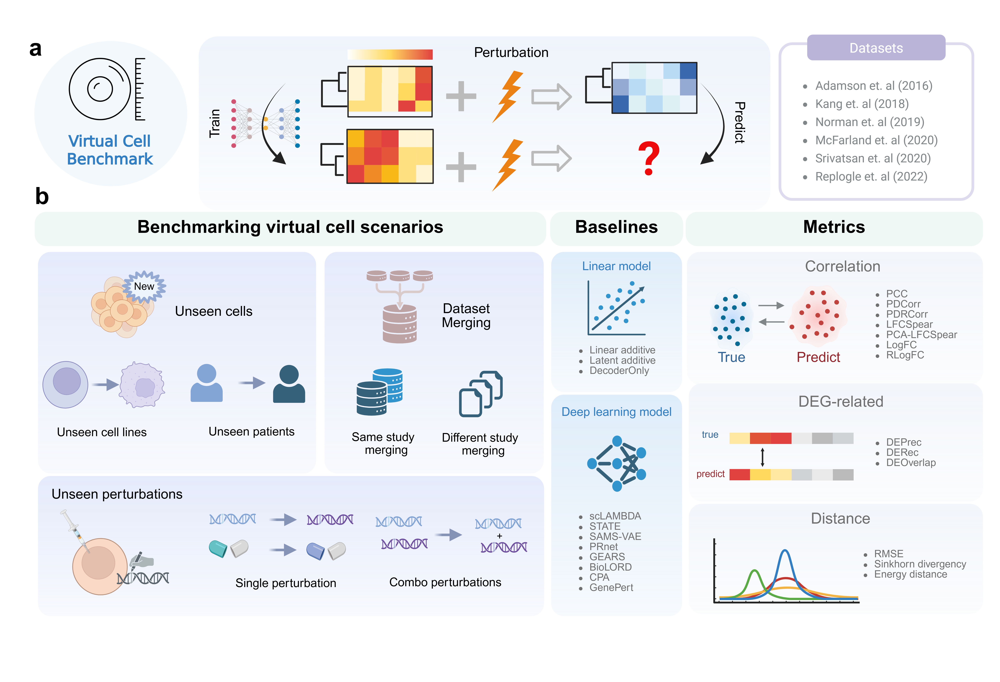

# VCBench Website

Companion website for **VCBench: Benchmarking Virtual Cell Models for In-the-Wild Perturbation Response**.

Project Links:
[Website](https://maoxinjie.github.io/VCBench-demo/)  
[Code](https://github.com/maoxinjie/VCBench/)

